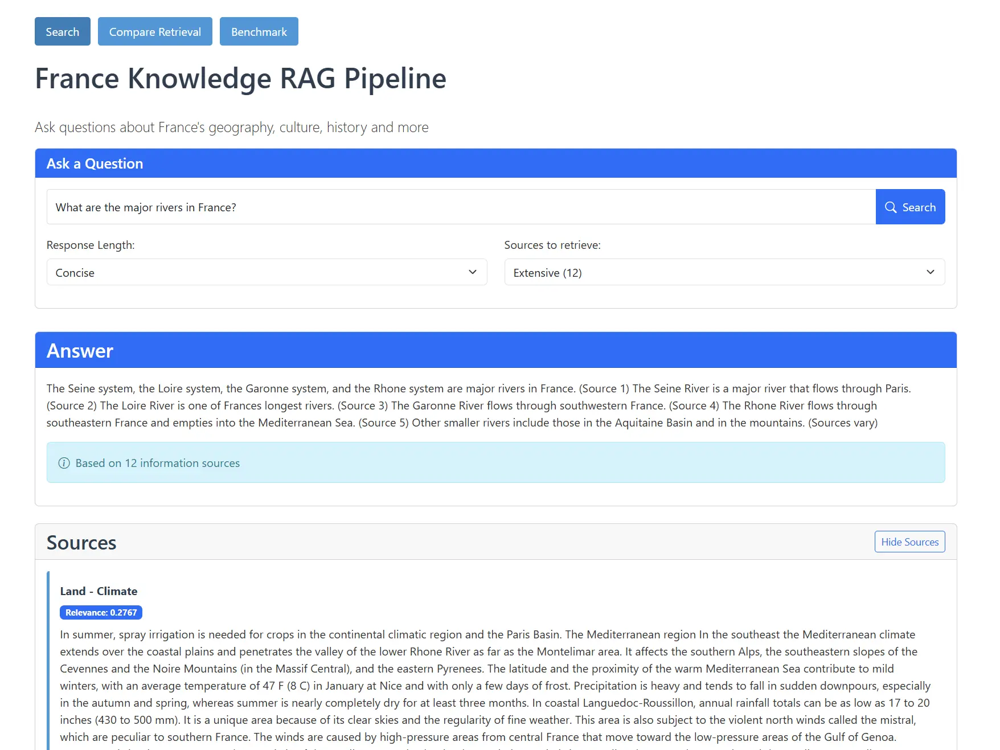
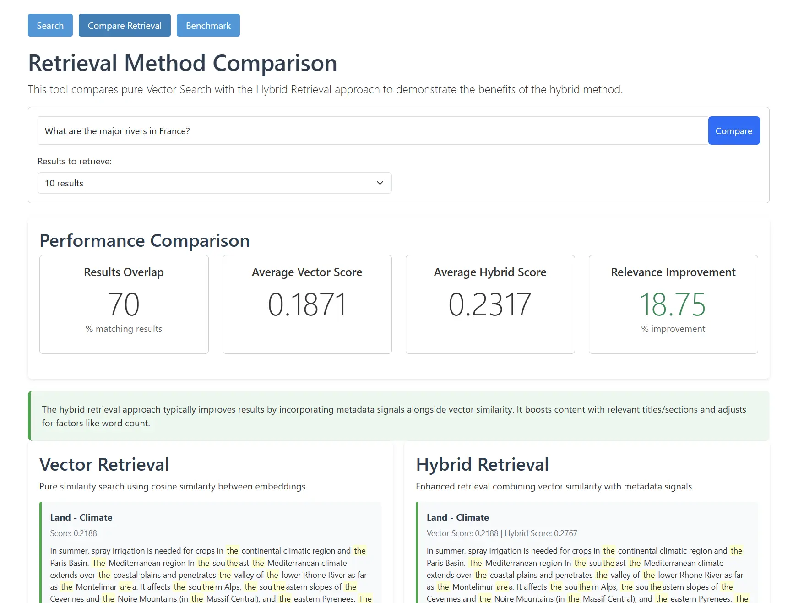
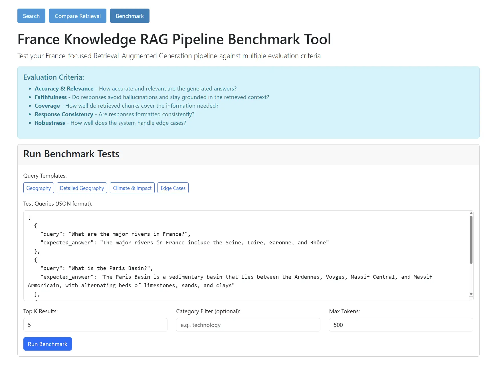

# FastAPI RAG Pipeline

A Retrieval-Augmented Generation (RAG) pipeline built with FastAPI that processes queries about France, retrieves relevant text chunks, and generates comprehensive responses using LLMs.

## Project Structure

```
.
├── src/
│   ├── data_utils.py         # Data processing, web scraping, and text chunking
│   ├── retrieval.py          # Vector embeddings and retrieval logic
│   ├── llm_service.py        # LLM integration (Together AI/OpenAI)
│   ├── main.py               # FastAPI application
│   ├── start_services.py     # Service launcher with health checks
│   ├── fix_embeddings.py     # Embeddings integrity checker
├── data/
│   ├── embeddings.pkl        # Precomputed vector embeddings
│   ├── processed_data.json   # Processed and chunked data
├── static/
│   ├── index.html            # Simple web UI
│   ├── compare.html          # Retrieval method comparison UI
│   └── benchmark.html        # Benchmarking UI
├── requirements.txt          # Project dependencies
└── Doc-Final Project.pdf     # Project documentation
```

## Features

- **Web Scraping**: Extracts information from encyclopedic sources about France
- **Text Processing**: Cleans and chunks text data with semantic awareness
- **Vector Search**: Uses embeddings for semantic similarity search
- **Hybrid Retrieval**: Combines vector similarity with metadata filtering
- **LLM Integration**: Works with Together AI or OpenAI for response generation
- **Web UI**: Simple interface for querying the system and viewing results
- **Benchmarking**: Advanced system for evaluating RAG pipeline performance against key metrics

## Quick Start

1. Install dependencies:
   ```
   pip install -r requirements.txt
   ```

2. Set environment variables:
   ```
   # For Together AI (preferred)
   TOGETHER_API_KEY=your_api_key_here

   # Or for OpenAI
   OPENAI_API_KEY=your_api_key_here
   ```

3. Extract text chunks and create embeddings (run these scripts before starting the service):
   ```
   python src/data_utils.py    # Extract and chunk data
   python src/retrieval.py     # Generate embeddings for chunks
   ```

4. Start the service:
   ```
   python start_services.py
   ```

5. Access the UI:
   Open your browser and visit http://localhost:8000

## 🎈 Streamlit App Deployment

### Run Streamlit App Locally:
```bash
streamlit run app.py
```

### Deploy on Streamlit Cloud (share.streamlit.io):
1. Push your code repository to GitHub.
2. Sign in to [Streamlit Cloud](https://share.streamlit.io).
3. Click **New app** and select your repository: `Dhanya562004/agentic-rag-pipeline-system` (Branch: `main`).
4. Set Main file path to: `app.py`.
5. Under **Advanced settings**, set Environment Secrets (e.g. `TOGETHER_API_KEY = "your_key"`).
6. Click **Deploy!**

## API Endpoints

- **GET /** - Web UI interface
- **GET /health** - Health check endpoint
- **POST /retrieve** - Retrieve relevant chunks for a query
- **POST /generate** - Generate a response using retrieved context
- **GET /stats** - Get embedding statistics
- **GET /llm-status** - Get LLM service status
- **POST /compare-retrieval** - Compare vector vs hybrid retrieval methods 
- **POST /benchmark** - Run comprehensive benchmarks against the RAG pipeline

## User Interface

Below are screenshots of the user interface and benchmarking tools:


*Main Query Interface*


*Retrieval Method Comparison*


*Benchmarking Dashboard*


## Course Information

**Course**: Data Mining  
**University**: University of Isfahan  
**Professor**: Dr. Mohammad Kiani    
**Semester**: Spring 2025

## License

[MIT License]

## Contributing

Contributions are welcome! Please feel free to submit a Pull Request.
